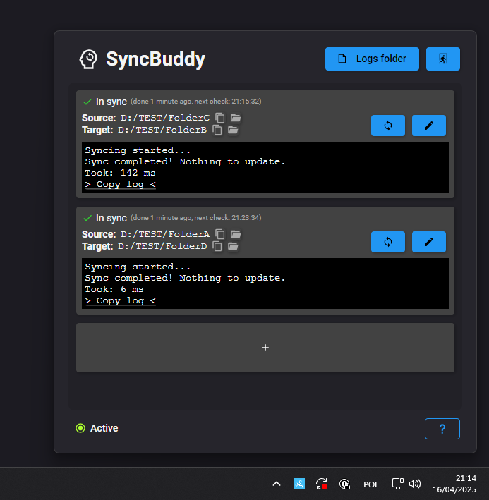
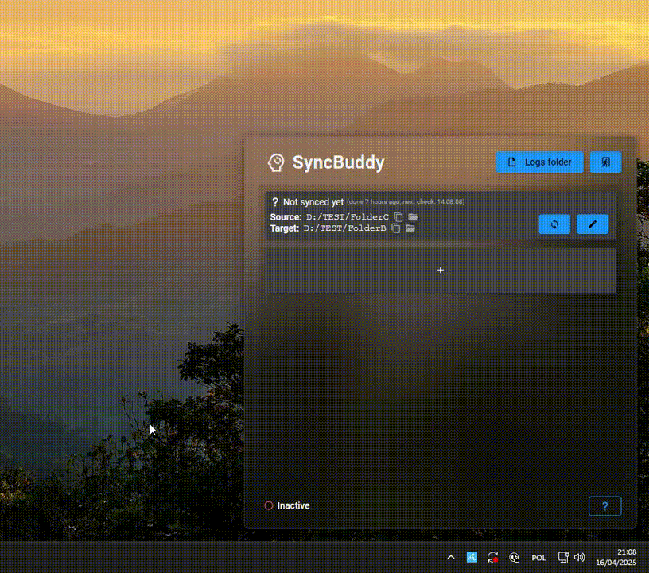
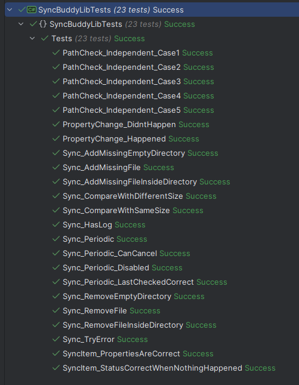

<div align="center">
    
  <h3 align="center">SyncBuddy</h3>

  <p align="center">
    A Windows app used to synchronize two folders. Literally just that!
  </p>
</div>

## About The Project
SyncBuddy is a simple app that synchronizes two folders together. SyncBuddyLib is a library that takes care of the whole magic. It's all wrapped in an Avalonia application and an easy to use CLI. Enjoy!

<div align="center">
    
</div>


## Features
* Synchronize two folders together, making sure that two folders are.. well, the same!
* Can be done on interval.
* The desktop app can keep track of multiple synchronizations
* CLI can do all the heavy lifting

## Usage
### Desktop App
1. Download, unpack and launch the app
2. It will pop-up and disappear once clicked out of it. Click the tray icon to bring it back
3. Add an entry with the big + button
4. Specify Source and Target directories, as well as intervals, whatnot. Click save.
5. Now, either click the synchronization button, or enable auto-synchronization by clicking the button on the bottom of the app
6. Close the app when you are done for the day. Easy as that
### CLI
```
SyncBuddyCli

  -s, --source      Required. Source directory
  -t, --target      Required. Target directory
  -i, --interval    Interval in minutes (optional)
  -l, --log         Log file path (optional)
  --help            Display this help screen.
  --version         Display version information.
```

## Development
### Building
Currently, only Windows is natively supported. Building should be as straightforward as running a dotnet app. You'll need .NET 8 to build it.

### Contributing
Feel free to submit any pull requests and I will happily review them. 

### Demo
<div align="center">
    
</div>

### Unit tests
You got it.
<div align="center">
    
</div>

# License 
Distributed under the GNU Affero General Public License v3.0. See `LICENSE` for more information.
